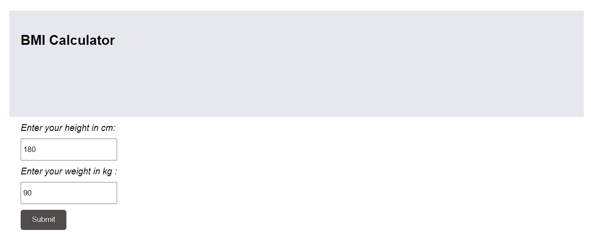

# Experiment 13
# BMI
# Aim:
To Create a BMI Calculator using React

# Algorithm:
1.Start React project,using "create-react-app projectName".

2.To create the folder,go to the folder using "code .".

3.To start the website using localhost,npm start.

4.Edit the components in the folder,for the project.

5.Edit App.js and enter the HTML code in the return and render.
# Program :
## app.css
```
.App {
    text-align: left;
    width:1024px;
    margin: 30px auto;
  }
  
  .App-logo {
    animation: App-logo-spin infinite 20s linear;
    height: 80px;
  }
  
  .App-header {
    background-color: #e7e7ee;
    height: 150px;
    padding: 20px;
    color: rgb(14, 10, 10);
  }
  
  .App-intro {
    font-size: large;
  }
  
  form{
  
    margin: 10px;
  
  }
  label, input{
    display: block;
    margin: 10px;
  }
  
  input{
  
    padding: 10px 3px;
     
  }
  
  input[type='submit']{
    padding: 10px 20px;
    border-radius: 5px;
    background: #514d4d;
    color: #ebe2e2;
    border: none;
    cursor: pointer;
  }
  
  @keyframes App-logo-spin {
    from { transform: rotate(0deg); }
    to { transform: rotate(360deg); }
  }
```
## app.js
```
import React, { Component } from 'react';
import './App.css';

class App extends Component {

  constructor(props) {
     super(props);
     this.state = { name: 'Guest', weight: 90, height: 180, bmi: 27, message: '', optimalweight: '', time: new Date().toLocaleTimeString() };
     this.submitMe = this.submitMe.bind(this);
     this.heightchange = this.heightchange.bind(this);
     this.weightchange = this.weightchange.bind(this);
     this.change = this.change.bind(this);  
     this.ticker = this.ticker.bind(this); 
     this.blur = this.blur.bind(this); 
     this.calculateBMI = this.calculateBMI.bind(this); 
  }


  heightchange(e){
    this.setState({height: e.target.value});
    e.preventDefault();
  }

  blur(e){
   this.calculateBMI();
  }
   weightchange(e){
    this.setState({weight: e.target.value});
    e.preventDefault();
  }

  calculateBMI(){

      var heightSquared = (this.state.height/100  * this.state.height/100);
      var bmi = this.state.weight / heightSquared;
      var low = Math.round(18.5 * heightSquared);                                                         
      var high = Math.round(24.99 * heightSquared);    
      var message = "";
      if( bmi >= 18.5  && bmi <= 24.99 ){
          message = "You are in a healthy weight range";
      }
      else if(bmi >= 25 && bmi <= 29.9){
        message = "You are overweight";
      }
      else if(bmi >= 30){
          message ="You are obese";
      }
      else if(bmi < 18.5){
        message = "You are under weight";
      }
      this.setState({message: message});  
      this.setState({optimalweight: "Your suggested weight range is between "+low+ " - "+high});    
      this.setState({bmi: Math.round(bmi * 100) / 100});   

  }

  submitMe(e) {
     e.preventDefault();
     this.calculateBMI();
  }

  ticker() {
    this.setState({time: new Date().toLocaleTimeString()})
  }
 
  componentDidMount(){
    setInterval(this.ticker, 60000);
  }

  change(e){
    e.preventDefault();
    console.log(e.target);
    this.setState({name: e.target.value});
  }

  render() {
    return (
      <div className="App">
        <div className="App-header">
          <h2>BMI Calculator</h2>
        </div>
          <form onSubmit={this.submitMe}>
            
             <label>
             <i>Enter your height in cm:</i> 
            </label>
            <input type="text" name="height" value={this.state.height} onBlur={this.blur} onChange={this.heightchange}   />
             <label>
             <i>Enter your weight in kg :</i> 
            </label>
            <input type="text" name="weight" value={this.state.weight} onChange={this.weightchange}    />
        
              <label>{this.state.message}</label>
              <label>{this.state.optimalweight}</label>
             
            <input type="submit" value="Submit"/>
          </form>
      
      </div>
    );
  }
}

export default App;
```
## app.test.js
```
import React from 'react';
import ReactDOM from 'react-dom';
import App from './App';

it('renders without crashing', () => {
  const div = document.createElement('div');
  ReactDOM.render(<App />, div);
});
```
# Output:

# Result :
Therefore we have succesfully created a BMI Calculator using React.
